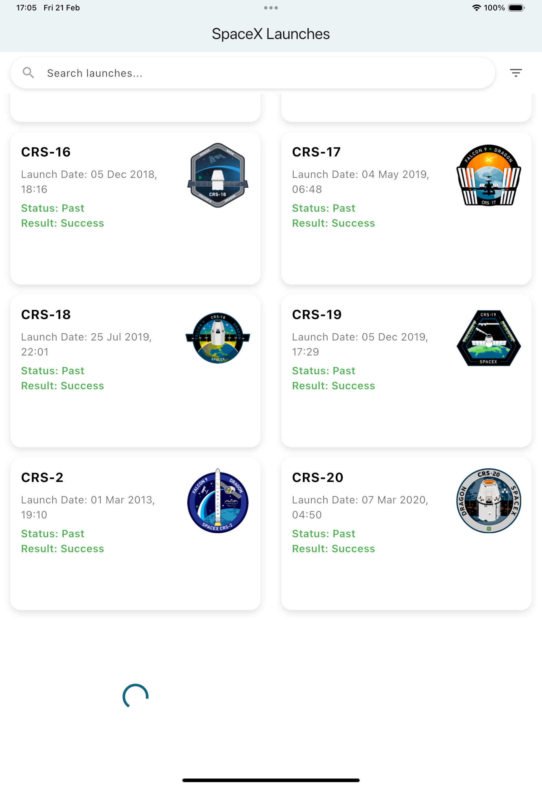

# PST SpaceX - Flutter App

This Flutter application displays SpaceX launches using the SpaceX API.
Users can **view launch details, sort, search, and navigate to a detailed page** for each mission.
The project follows **Clean Architecture** and uses **BLoC for state management**.

---

## 📜 Project Setup Instructions
### 🔹 **1. Clone the repository**
```sh
git clone https://github.com/your-repo/spacex-launches.git
cd spacex-launches
fvm flutter use 3.29.0
fvm flutter pub get
sh initial.sh
```


## Project Structure
```
lib/
├── common/
│   ├── utils/
│   │   └── responsive.dart  # Handles UI responsiveness
│   └── widgets/images/
│       └── app_image.dart  # Widget for displaying images
│
├── core/
│   ├── api/
│   │   ├── api_config.dart  # API configurations
│   │   └── api_service.dart  # API service for fetching data
│   └── configuration/
│       └── app_flavor.dart  # App flavor settings (mock/prod)
│
├── di/
│   └── app_module.dart  # Dependency Injection setup
│
├── extension/
│   └── date_extension.dart  # Helper for formatting dates
│
├── features/
│   └── launch/
│       ├── data/
│       │   ├── datasources/
│       │   │   ├── launch_remote_data_source.dart  # Fetches launch data from API
│       │   │   ├── mock_launch_remote_data_source.dart  # Mock API data source
│       │   ├── models/
│       │   │   ├── launch_model.dart  # Launch data model
│       │   │   ├── launchpad_model.dart  # Launchpad data model
│       │   │   ├── rocket_model.dart  # Rocket data model
│       │   ├── repositories/
│       │   │   └── launch_repository_impl.dart  # Implements repository pattern
│       │
│       ├── domain/
│       │   ├── entities/
│       │   │   ├── launch.dart  # Launch entity
│       │   │   ├── launchpad.dart  # Launchpad entity
│       │   │   ├── rocket.dart  # Rocket entity
│       │   ├── repositories/
│       │   │   └── launch_repository.dart  # Repository interface
│       │   ├── usecases/
│       │       ├── get_launchpad_id.dart  # Fetches launchpad details
│       │       ├── get_query_launches.dart  # Fetches launches with query
│       │       ├── get_rocket_id.dart  # Fetches rocket details
│       │
│       ├── presentation/
│       │   ├── bloc/
│       │   │   ├── launch_bloc.dart  # Main BLoC for launches
│       │   │   ├── launch_event.dart  # Events for launch BLoC
│       │   │   ├── launch_state.dart  # States for launch BLoC
│       │   │   ├── detail/
│       │   │   │   ├── launch_detail_bloc.dart  # Handles launch detail state
│       │   ├── pages/
│       │   │   ├── launch_page.dart  # Launch list screen
│       │   │   ├── launch_detail_page.dart  # Launch detail screen
│       │   ├── widgets/
│       │   │   ├── launch_list_item.dart  # Widget for launch list items
│       │   │   ├── search_bar_widget.dart  # Search bar widget
│       │   │   ├── sort_options_widget.dart  # Sorting options widget
│
├── generator/
│   └── assets.gen.dart  # Manages assets
│
├── main.dart  # Application entry point
│
assets/
├── .env-mock  # Mock environment configuration
└── .env-prod  # Production environment configuration
│
test/
├── features/
│   └── launch/
│       ├── data/
│       │   ├── launch_remote_data_source_test.dart  # Tests API data source
│       │   ├── mock_launch_data.json  # Mock test data
│       ├── domain/
│       │   ├── get_launchpad_id_test.dart  # Tests fetching launchpad data
│       │   ├── get_rocket_id_test.dart  # Tests fetching rocket data
│       ├── presentation/bloc/
│       │   ├── launch_bloc_test.dart  # Tests for launch BLoC
│
└── widget_test.dart  # General UI tests
```


## 📸 UI Showcase  

### **📌 Mobile View**  


| Main Screen | Detail Page | Search | Sort |
|------------|------------|--------|------|
|  |  |  |  |
|  |  |  |  |
|  |  |  |  |

---

### **📌 Tablet View (iPad UI)**  
| Main Screen | Detail Page | More Info | Search | Sort |
|------------|------------|------------|--------|------|
|  |  |  |  |  |
|  |  |  |  |  |

---
